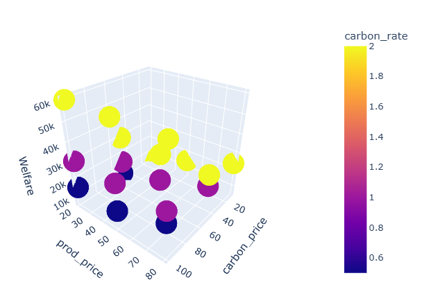
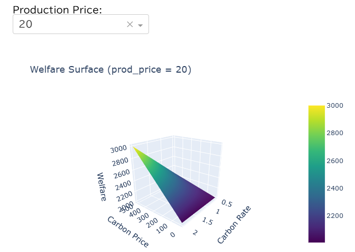
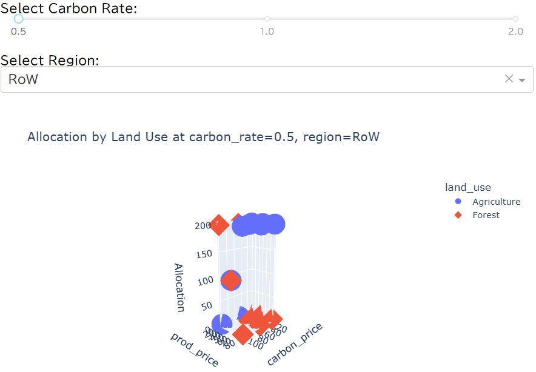

# Simple Land Use Allocation Model using Pyomo

This project demonstrates a simple stylized land use allocation model implemented using [Pyomo](http://www.pyomo.org/). The model simulates land allocation decisions between agriculture and forest sectors across two regions (Tropics and Rest of World), while maximizing welfare that is influenced by production price, carbon price, and carbon sequestration rate.

## Features

- Formulation of a basic welfare-maximizing land use allocation model using Pyomo.
- Sensitivity analysis across key parameters (`carbon_price`, `prod_price`, `carbon_rate`).
- Generation of a summary dataset of land allocation and welfare.
- Visualization of results using:
  - 2D plots (`matplotlib`, `seaborn`).
  - 3D interactive surface plots (`Plotly`).
- Interactive web-based visualization using [Dash](https://dash.plotly.com/).

## Repository Structure

- `Land_Use_Spatial_Equilibrium_Model.ipynb`: Jupyter Notebook containing model definition, parameter sensitivity analysis, data visualization, and discussion of results.
- The model explores how welfare responds to changes in production price, carbon price, and carbon sequestration rate, including interaction effects.
- Additionally, the Notebook shows how to deploy the resulting dataset into a Dash app for interactive exploration.

## How to Run

1. Install required packages:
    ```bash
    pip install pyomo pandas matplotlib seaborn plotly dash
    ```

2. Run the Notebook:
    ```bash
    jupyter notebook Land_Use_Spatial_Equilibrium_Model.ipynb
    ```

3. Optionally, run the Dash app:
    - The Notebook includes example code to create a standalone Dash app that visualizes welfare as a 3D surface.
    - Run the Dash app script (or extract from the Notebook):
        ```python
        python dash_app.py
        ```
    - This will open a browser at `http://127.0.0.1:8050`.

## Dash App Features

- Interactive 3D surface plot of `Production Price`, `Carbon Price`, and `Allocation`.
- A slider allows you to dynamically change the `Carbon Rate` and `Region`.
- Built using `Plotly` and `Dash`, enabling deployment as a lightweight web app for decision support or demonstration.

---

## Model Description

### Objective
Maximize total welfare, defined as the sum of:
- Revenue from agricultural land
- Value of carbon sequestration from forest land

### Decision variables
- Land allocation for **Agriculture** and **Forest** per region
- Total welfare

### Parameters
- `carbon_price`: Carbon price ($/ton CO2)
- `prod_price`: Agricultural production price ($/unit)
- `carbon_rate`: Carbon sequestration rate (ton CO2 per land unit)

### Regions
- Tropics
- Rest of the World (RoW)

### Constraints
- Land balance in each region (total land allocation cannot exceed available land)

---

## Sensitivity Analysis

We performed simulations varying:
- `carbon_price`: 10, 50, 100 USD
- `prod_price`: 20, 50, 80 USD
- `carbon_rate`: 0.5, 1, 2 ton CO2/unit land

### Key findings
- **Higher carbon price** increases welfare by incentivizing more forest land allocation.
- **Higher carbon sequestration efficiency (`carbon_rate`)** amplifies the positive effect of carbon price on welfare.
- **Higher agricultural production price (`prod_price`)** leads to higher welfare across all scenarios by increasing the value of agricultural land use.
- There is a clear **interaction between parameters**, showing the balance between agriculture and forest shifts depending on policy and technological settings.

---

## Requirements

- Python 3.9+
- pyomo
- pandas
- seaborn
- plotly
- dash



